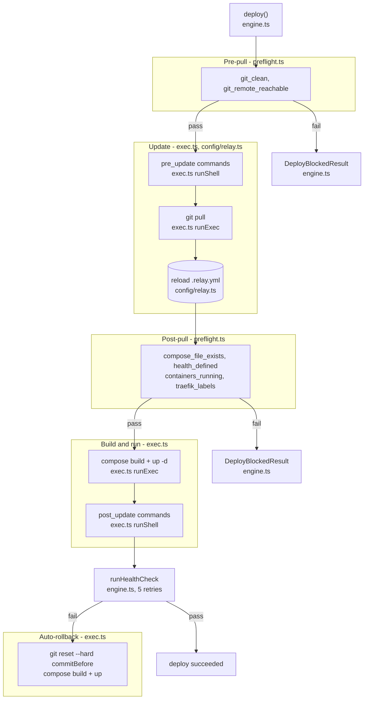

# agent-relay

The deploy daemon for AI-driven VPS deployments. Claude Code (or any MCP client) and [deploy-panel](https://github.com/LanNguyenSi/deploy-panel) can deploy, rollback, and monitor your Docker Compose apps without ever opening an SSH session.

```
                         AUTH_TOKEN gate
                               |
                               v
[Claude Code]   --MCP-->  +------------+   --git pull--> [Your Apps]
                          |            |   --compose -->  (Docker
[deploy-panel]  --HTTP--> | agent-relay |  --health  -->   Compose
                          |            |   --rollback->   under
[uptime probe]  --GET --> +------------+                  APPS_DIR)
                /health (no auth)
```

## Why not just SSH + Docker

`ssh root@vps && docker compose up -d` works on day one. It stops working when:

- An AI agent needs to do it. `ssh` requires a private key and a TTY; an MCP-driven agent has neither.
- You want pre-flight checks before clobbering a working deploy. The relay validates the working tree and remote *before* pulling (`git_clean`, `git_remote_reachable`), then validates `compose_file` exists, containers are running, Traefik labels are present, and the health endpoint is defined *after* pulling against the new on-disk config.
- A health check fails after `compose up`. The relay auto-rolls back to the previous commit; bare SSH leaves you with a broken deploy.
- You want a deploy history. The relay keeps the last 100 deploys (across all apps) with commit before/after, status, duration, and trigger source.
- You're managing more than one VPS. Centralised state in deploy-panel, identical API on each box.

The relay is a daemon, not a CLI: one auth token, one HTTP/MCP surface, no SSH key sprawl.

## Try it in 60 seconds

On a fresh Ubuntu/Debian VPS:

```bash
curl -sSL https://raw.githubusercontent.com/LanNguyenSi/agent-relay/main/install.sh -o /tmp/agent-relay-install.sh
sudo RELAY_DOMAIN=relay.example.com \
     TRAEFIK_EMAIL=you@example.com \
     bash /tmp/agent-relay-install.sh
```

> **Note:** env vars must be set on the `sudo` line (not as a prefix to `curl` -- the pipe binds them to the download process, not the bash that runs the script). If your sudoers strips command-line variables, export them and use `sudo -E`, or run as root directly.

The installer detects what's on port 80, picks an install mode (greenfield with Traefik / join an existing Traefik / port-only behind nginx), pulls `ghcr.io/lannguyensi/agent-relay:latest`, and prints a generated `AUTH_TOKEN`. See [docs/operations.md](docs/operations.md) for the full mode matrix and env vars.

The relay runs `docker compose` for deployed apps from inside its own container, so the docker daemon needs the host's `/apps` to be the same directory as `APPS_DIR`. The installer sets this up automatically (a `/apps -> $APPS_DIR` symlink when they differ) and fails loudly if it cannot; see [docs/operations.md](docs/operations.md#apps_dir-hostcontainer-contract) for the full contract.

If you don't yet have a domain, drop `RELAY_DOMAIN` and the installer falls back to `port-only` mode (loopback bind, no TLS):

```bash
curl -sSL https://raw.githubusercontent.com/LanNguyenSi/agent-relay/main/install.sh | sudo bash
```

### Non-root install

If you are in the `docker` group you can run the installer without `sudo`. The installer detects that `docker info` succeeds without root and switches to non-root mode automatically:

```bash
curl -sSL https://raw.githubusercontent.com/LanNguyenSi/agent-relay/main/install.sh \
  | RELAY_MODE=existing-traefik RELAY_DOMAIN=relay.example.com bash
```

The env vars go to the right of the pipe so they reach the `bash` that runs the script, not the `curl` process.

Requirements for non-root mode:

- **docker group membership** -- your user must be in the `docker` group (`sudo usermod -aG docker $USER`, then log out and back in) so that `docker info` succeeds without `sudo`.
- **HOME-writable directories** -- config, compose files, and apps are written to HOME-relative paths. Defaults and overrides:
  - `RELAY_DIR` defaults to `$HOME/.local/share/agent-relay` (override with `RELAY_DIR=...`). The default `/opt/agent-relay` is never created in non-root mode.
  - `APPS_DIR` defaults to `$HOME/.local/share/agent-relay/apps` (override with `APPS_DIR=...`). The default `/home/deploy/apps` is never created in non-root mode.
- **Existing reverse proxy for TLS** -- `RELAY_MODE=greenfield` (which provisions Traefik and binds :80/:443) requires root and is rejected with a clear error in non-root mode. Use `RELAY_MODE=existing-traefik` (join an existing Traefik) or `RELAY_MODE=port-only` (no TLS, let your own proxy handle it) instead.

## Deploy lifecycle

Each app on the VPS is a git repo with a `docker-compose.yml` and a `.relay.yml`. The default flow:

1. **Deploy.** `pre_update` commands → `git pull` → re-read `.relay.yml` → pre-flight checks → `docker compose build` → `docker compose up -d` → `post_update` commands.
2. **Health check.** In-container probe: for each running compose service, `docker compose exec` runs a `node -e` fetch against `http://localhost:<port><health>` — the port comes from `health_port`, or a fixed candidate list (3000, 3001, 4000, 5000, 8000, 8080). Up to 5 attempts, 5 seconds apart; the first service/port that responds OK passes.
3. **Auto-rollback.** On health failure, `git reset --hard` to the previous commit, rebuild, restart.

`.relay.yml` is re-read **after** `git pull` on purpose: a commit that *fixes* a broken `.relay.yml` lets the deploy through, instead of pre-flight gating on the stale pre-pull copy. Full rationale in [docs/security.md](docs/security.md#why-relayyml-is-re-read-after-git-pull).

### Default flow

The diagram traces the default deploy path through `src/deploy/engine.ts`, from pre-pull preflight checks to health verification and auto-rollback.



## Next steps

| If you want to... | Read |
|------|------|
| Install the relay on a VPS, configure modes, run it locally | [docs/operations.md](docs/operations.md) |
| Wire up an app's `.relay.yml`, call the HTTP API, use the 5 MCP tools | [docs/integration.md](docs/integration.md) |
| Understand the auth model, the shell-exec trust boundary, and the public vs authenticated endpoints | [docs/security.md](docs/security.md) |

## Tech stack

- Node.js 20+ / TypeScript
- [MCP SDK](https://github.com/modelcontextprotocol/typescript-sdk) (Model Context Protocol)
- [Hono](https://hono.dev) (HTTP API)
- [Dockerode](https://github.com/apocas/dockerode) (Docker API client)
- [Zod](https://zod.dev) (config and input validation)

## Related

- [deploy-panel](https://github.com/LanNguyenSi/deploy-panel): Web UI for managing servers and deployments.

## License

[MIT](LICENSE)
